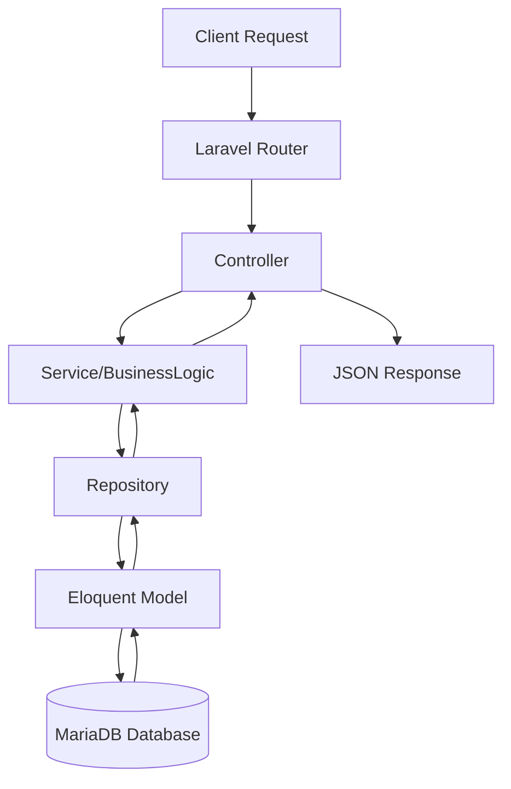

# proptier-pre-assignment
프롭티어 사전 과제

## Description
이 프로젝트는 Laravel 12 이상과 PHP 8.1+ 환경에서 동작하는 회원기능 및 게시판 API를 구현하는 사전 과제입니다.


구현 범위:
- 사용자: 회원가입, 로그인, 로그아웃, 탈퇴
- 사용자 CRUD: 생성/조회/수정/삭제 (수정·삭제는 본인만)
- 사용자 필드: 아이디(id), 이름(name), 이메일(email), 비밀번호(password)
- 아이디 규칙: 12~20자, 영문 대소문자+특수문자 필수
- 비밀번호: 안전한 암호화 저장
- 이메일: 이메일 형식만 입력
- 게시글 생성: 로그인 사용자가 글 작성
- 게시글 조회: 로그인 사용자만 읽기 가능
- 게시글 수정/삭제: 작성자 본인만 가능
- 페이징: 페이지당 노출 개수 요청 가능
- 검색: 제목으로 검색 가능
- 날짜 범위 검색: 작성일 기준 from~to 지원
- 댓글: 댓글 및 대댓글 기능 지원
- 좋아요: 등록/해제, 페이징 응답에 좋아요 개수 포함
---

## Visuals



---

# Steps
```bash

# 1. 의존성 설치
composer install

# 2. 환경 설정
cp .env.example .env
php artisan key:generate

# 3. DB 마이그레이션
php artisan migrate
※ 전체 초기화후 재실행(선택)
php artisan migrate:fresh

# 4. 서버 실행
php artisan serve
```

---

### Usage (Postman Collection)

* endPoint : [http://localhost:8000](http://localhost:8000)
* loginToken : 로그인 성공 토큰
* env 설정파일 : `postman/proptier_env.postman_environment`
* `postman/collection.json` 에 API 테스트를 위한 Postman Collection 이 포함됩니다.

---

### 설계 및 개발 환경

* **Language** : PHP 8.2
* **Framework** : Laravel 12.x
* **Database (RDBMS)** : MariaDB 11.7.2
* **Authentication** : Laravel Sanctum (Token 기반 인증)
* **Password Hashing** : bcrypt
* **ORM** : Eloquent ORM
* **패키지 관리** : Composer
* **기타** : Postman을 이용한 API 테스트, 마이그레이션 & 시더로 초기 데이터 구성

---

## Database Table 설계도

### `users`

| 컬럼명         | 타입           | 제약조건             | 설명      |
| ----------- | ------------ | ---------------- | ------- |
| id          | BIGINT (PK)  | Auto Increment   | 사용자 PK  |
| userid      | VARCHAR(20)  | UNIQUE           | 로그인 아이디 |
| password    | VARCHAR(255) | NOT NULL         | 비밀번호 해시 |
| name        | VARCHAR(255) | NOT NULL         | 이름      |
| email       | VARCHAR(255) | UNIQUE, NOT NULL | 이메일     |
| created\_at | TIMESTAMP    |                  | 생성일     |
| updated\_at | TIMESTAMP    |                  | 수정일     |

---

### `boards`

| 컬럼명         | 타입           | 제약조건                        | 설명     |
| ----------- | ------------ | --------------------------- | ------ |
| id          | BIGINT (PK)  | Auto Increment              | 게시글 PK |
| user\_id    | BIGINT (FK)  | users.id, ON DELETE CASCADE | 작성자    |
| title       | VARCHAR(150) | INDEX (idx\_boards\_title)  | 제목     |
| content     | LONGTEXT     | NOT NULL                    | 내용     |
| created\_at | TIMESTAMP    |                             | 생성일    |
| updated\_at | TIMESTAMP    |                             | 수정일    |

---

### `board_comments`

| 컬럼명         | 타입                | 제약조건                                           | 설명       |
| ----------- | ----------------- | ---------------------------------------------- | -------- |
| id          | BIGINT (PK)       | Auto Increment                                 | 댓글 PK    |
| board\_id   | BIGINT (FK)       | boards.id, ON DELETE CASCADE                   | 게시글 ID   |
| user\_id    | BIGINT (FK)       | users.id, ON DELETE CASCADE                    | 작성자 ID   |
| parent\_id  | BIGINT (FK, self) | board\_comments.id, ON DELETE CASCADE, NULL    | 부모 댓글 ID |
| depth       | SMALLINT UNSIGNED | DEFAULT 0                                      | 댓글 뎁스    |
| path\_bin   | VARBINARY(256)    | INDEX (idx\_board\_comments\_board\_path\_bin) | 댓글 정렬 경로 |
| content     | TEXT              | NOT NULL                                       | 댓글 내용    |
| created\_at | TIMESTAMP         |                                                | 생성일      |
| updated\_at | TIMESTAMP         |                                                | 수정일      |

---

### `board_likes`

| 컬럼명         | 타입                    | 제약조건                                   | 설명        |
| ----------- | --------------------- | -------------------------------------- | --------- |
| id          | BIGINT (PK)           | Auto Increment                         | 좋아요 PK    |
| board\_id   | BIGINT (FK)           | boards.id, ON DELETE CASCADE           | 게시글 ID    |
| user\_id    | BIGINT (FK)           | users.id, ON DELETE CASCADE            | 사용자 ID    |
| ip\_address | VARCHAR(45)           | NULLABLE                               | 작성자 IP    |
| created\_at | TIMESTAMP             |                                        | 생성일       |
| updated\_at | TIMESTAMP             |                                        | 수정일       |
| (unique)    | (board\_id, user\_id) | UNIQUE (uq\_board\_likes\_board\_user) | 중복 좋아요 방지 |

---
